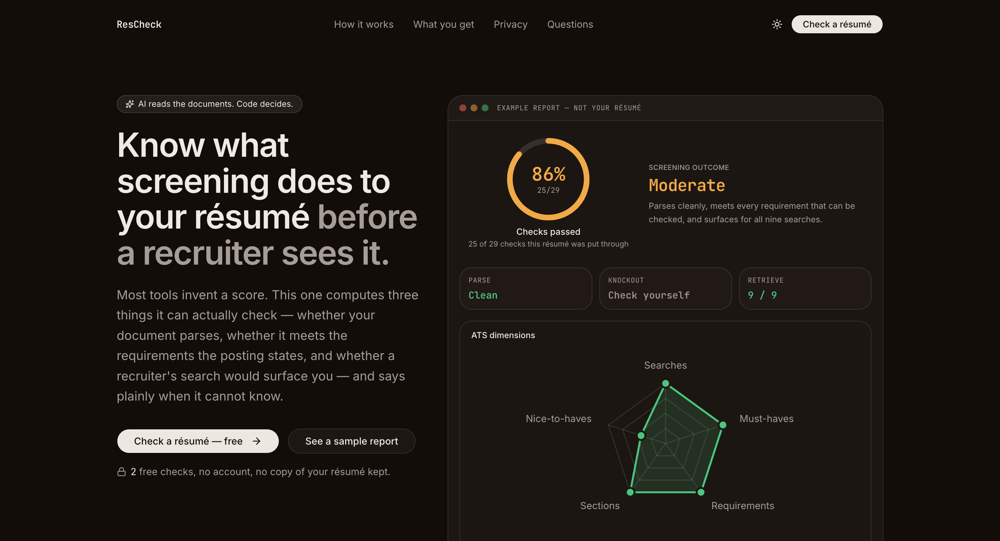
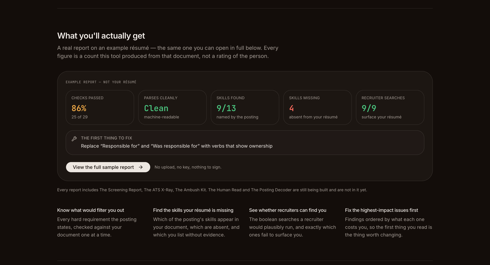
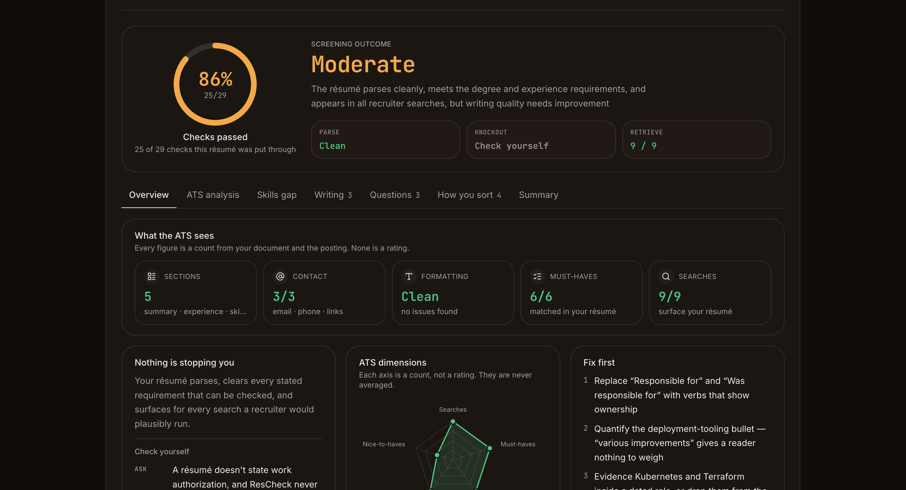
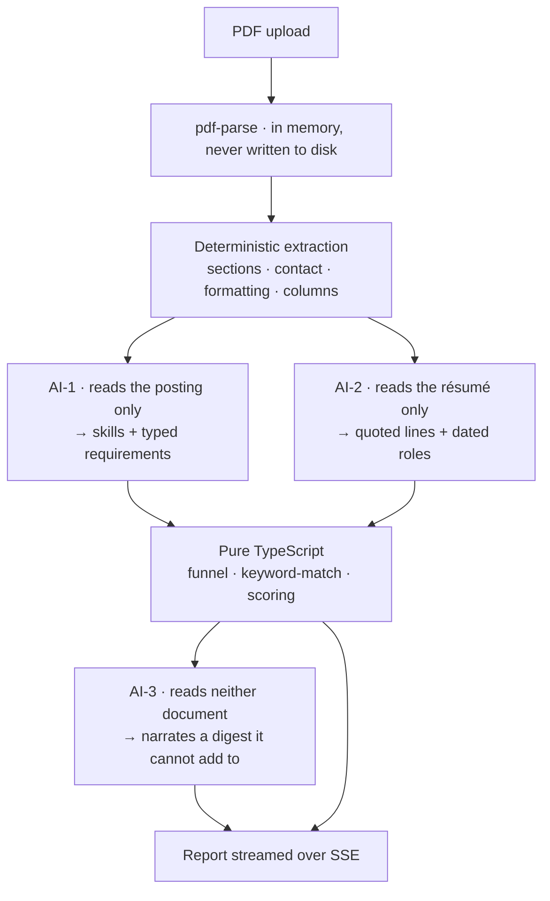
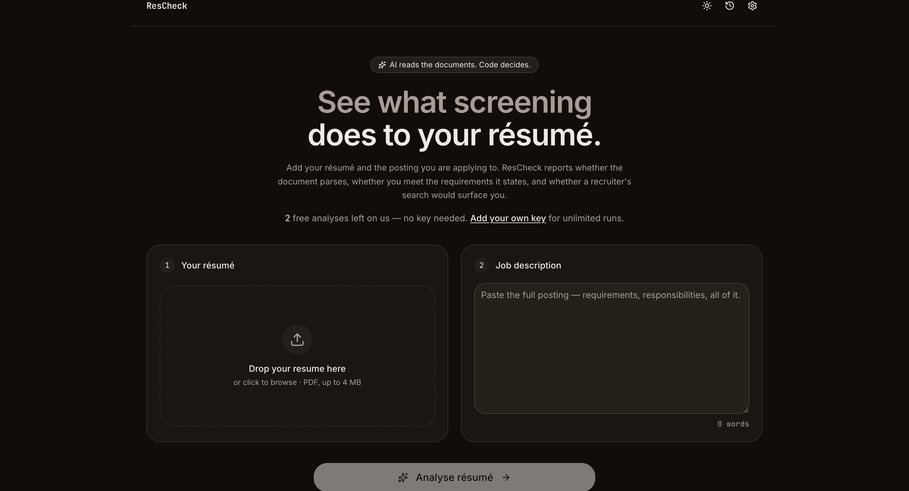

<div align="center">

# ResCheck

### Know what screening does to your résumé — before a recruiter sees it.

Most résumé tools invent a score. This one computes three things it can actually check, and says plainly when it cannot know.

[**Try it →**](https://rescheck.vercel.app) · [See a sample report](https://rescheck.vercel.app/#sample)

</div>



---

## Why this exists

Every résumé checker gives you a number. Almost none of them can tell you where it came from.

That number is usually invented — a weighted blend of sub-scores a model was asked to guess at. It feels precise and means nothing, because no real applicant tracking system computes it. Surveys consistently find that ATS software does **not** auto-reject on résumé content; it stores and searches applications. What rejects you automatically is the knockout question on the application form.

So ResCheck refuses to guess. It answers three questions it can genuinely answer:

1. **Does your document parse?** What a machine actually extracts from your PDF, and what it silently drops.
2. **Do you meet the stated requirements?** Every hard requirement the posting names, checked one at a time — and marked *unverifiable* where a résumé simply cannot say.
3. **Would a recruiter's search surface you?** The boolean queries a recruiter would plausibly run, and exactly which ones miss you.

The headline figure is arithmetic, not a rating: **25 of 29 checks passed** is a literal count of discrete checks the tool ran. Checks nobody could run are excluded from both sides of the fraction and named, so an unanswerable question never counts against you.

**Who it's for:** anyone applying for jobs who wants to know what a machine sees before a human does — and would rather have an honest "we can't check that" than a confident fabrication.

---

## What you get



- **The Screening Report** — three gates (Parse · Knockout · Retrieve), each with a real answer or an explicit "check this yourself."
- **The ATS X-Ray** — exactly what a parser pulls out of your document: sections found, contact details that survived, and what got dropped on the way.
- **The Ambush Kit** — the interview questions your résumé invites: the employment gap, the short tenure, the skill you list but never evidence.
- **Line-by-line writing findings** — weak verbs, passive constructions and vague claims, quoted verbatim with a suggested rewrite.
- **ATS dimensions** — five ratios plotted as a radar. An axis that can't be measured leaves a *visible break* in the outline rather than plotting at zero.
- **Sorting signals** — total experience, skill recency, average tenure, unevidenced skills. Named factors, deliberately never combined into a score.



---

## Key features

| | |
|---|---|
| **Derived, never invented** | Every figure is computed in pure TypeScript from your documents. The AI extracts typed records; code decides. |
| **Says when it can't know** | Work authorisation and location are always `unverifiable` — a résumé doesn't state them, and ResCheck never sees the application form. |
| **No account, no database** | History lives in your browser's localStorage. There is nothing to log into, because there is nothing to log in to. |
| **No copy of your résumé kept** | Parsed in memory to build the report, never written to disk. There is no delete step because there is no save. |
| **Bring your own key, or don't** | 2 free analyses on the hosted key. Add your own Groq or Gemini key for unlimited runs. |
| **Honest degradation** | If a stage fails you get a warning and the parts that worked — never a silent fabrication. |
| **Fully theme-aware** | Light, dark, or follow your system. Reduced motion is a designed path, not an absence. |

---

## How it works

The AI never scores you. It reads documents and returns typed records; every outcome is computed deterministically and unit-tested.



Three specialist prompts, none of which is ever asked for a score:

- **AI-1** sees the job posting and nothing else. It copies the requirements the posting states.
- **AI-2** sees the résumé and nothing else. It quotes lines verbatim and reports dated roles.
- **AI-3** sees neither. It narrates a digest of numbers that code already computed.

Because AI-1 never sees your résumé and AI-3 sees no document at all, the whole pipeline fits comfortably inside a free-tier token budget.

---

## Getting started

**Requirements:** Node.js 20+ and an API key from [Groq](https://console.groq.com) or [Google AI Studio](https://aistudio.google.com/apikey). Both have free tiers.

```bash
git clone https://github.com/avneetxsingh/ResCheck.git
cd ResCheck
npm install
npm run dev
```

Open <http://localhost:3000>. You can use the app immediately by adding your own API key in **Settings** — no environment variables needed.

### Optional: serve free runs on your own key

To let visitors run analyses without a key of their own, create `.env.local`:

```bash
HOSTED_PROVIDER=groq                    # or "gemini"
HOSTED_PROVIDER_API_KEY=your-key-here
FREE_RUN_SECRET=$(openssl rand -hex 32) # must be ≥16 characters
```

Leave them unset and the app still works — it reports the hosted path as unavailable, honestly, and runs in bring-your-own-key mode.

### Commands

```bash
npm run dev     # development server
npm run build   # production build
npm test        # 334 unit tests
npm run lint    # eslint
```

---

## Configuration

| Variable | Required | Description |
|---|---|---|
| `HOSTED_PROVIDER` | No | `groq` or `gemini`. Which provider serves free runs. Swapping providers is an env change, not a code change. |
| `HOSTED_PROVIDER_API_KEY` | No | The owner's key used for free runs. Without it, the hosted path reports itself unavailable. |
| `FREE_RUN_SECRET` | No | HMAC secret signing the free-run counter cookie. Must be **≥16 characters** or the hosted path refuses to run — serving unmetered analyses on your own key is the one failure with an unbounded bill. |

Two operating modes, decided by `src/lib/analysis-mode.ts`:

- **Power User** — a request carrying `x-provider-api-key` is unmetered, picks its own provider and model, and pays with its own key.
- **Hosted** — a request with no key runs on the owner's key, is capped by a signed cookie, and **chooses nothing**. Honouring a caller's model choice would let a stranger point the owner's key at the most expensive model on offer. A unit test pins that.

Other limits worth knowing: uploads are capped at **4 MB** and **20 pages**; the free-run allowance is **2**. Each number lives in exactly one constant, and tests fail the build if an advertised number and an enforced one ever diverge.

---

## Usage



1. Drop in a PDF résumé (up to 4 MB).
2. Paste the full job posting — requirements, responsibilities, all of it.
3. Press **Analyse**.

Results stream in as they are computed. The parse and retrieval gates land in about 8 seconds; the writing audit takes longer, and the page shows what is still running rather than a fake progress bar. A typical run settles in around 25 seconds.

**Want to see the output first?** [Open the sample report](https://rescheck.vercel.app/#sample) — a complete real report on an example résumé, with no upload, no key and no signup.

### The API, if you would rather script it

```bash
# 1. Extract text from a PDF
curl -X POST https://rescheck.vercel.app/api/parse-pdf \
  -F "resume=@resume.pdf;type=application/pdf"

# 2. Analyse it against a posting (streams Server-Sent Events)
curl -N -X POST https://rescheck.vercel.app/api/analyze \
  -H "Content-Type: application/json" \
  -H "x-provider-api-key: $YOUR_KEY" \
  -d '{"resume_text":"...","job_description":"..."}'
```

The stream emits `stage`, `warning`, `partial`, and exactly one terminal `result` or `error`.

---

## Tech stack

**Next.js 16** (App Router, Turbopack) · **React 19** · **TypeScript 5** strict · **Tailwind 4** (CSS-first `@theme`) · **shadcn** on `@base-ui/react` · **zod 4** · **vitest**

Providers: `groq-sdk` and `@google/genai` sit behind a common adapter, so adding one means implementing an interface rather than editing the route.

```
src/
├─ app/api/          analyze (SSE pipeline) · parse-pdf · free-runs
├─ lib/              funnel · keyword-match · ats-extract · ambush-kit
│                    scoring · work-history · free-runs · providers/
├─ components/       landing/ · workspace/ · results/ · analyze/
└─ types/            the shapes every layer agrees on
```

Everything in `src/lib/` is pure and unit-tested. The route orchestrates; it does not decide.

---

## Contributing

Contributions are genuinely welcome — issues, ideas and pull requests alike.

A few things that will make your PR land smoothly:

- **Run the checks.** `npm test`, `npx tsc --noEmit` and `npm run build` should all be clean. There are 334 tests; new behaviour in `src/lib/` wants a test alongside it.
- **Never invent a number.** This is the project's one hard rule. If the app cannot derive something, it says so. A field that displays a value the code cannot compute will not be merged.
- **Copy is scoped to storage, never transit.** The résumé is POSTed to the API and the key travels as a header, so "never leaves your browser" is false. Say "no copy kept" instead — there is a test that enforces this.
- **Match the surrounding code.** Comments here explain *why*, not what. If a constraint is not obvious, write down the reason.
- **Small, reversible changes.** One idea per PR is easier to review than five.

Found a bug in the analysis itself — a requirement misread, a skill matched wrongly? Those are the most valuable reports. Include the posting text and what you expected, and it can become a fixture-backed regression test.

---

## License

MIT — see [LICENSE](LICENSE). Use it, fork it, ship your own version.

---

<div align="center">

Built because getting ghosted without knowing why is worse than getting rejected with a reason.

**[rescheck.vercel.app](https://rescheck.vercel.app)**

</div>
